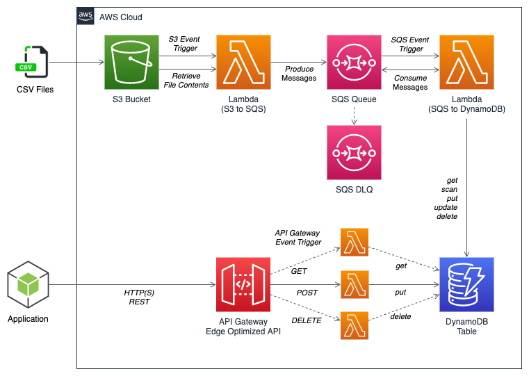
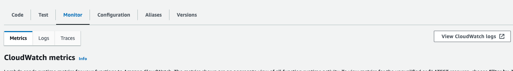
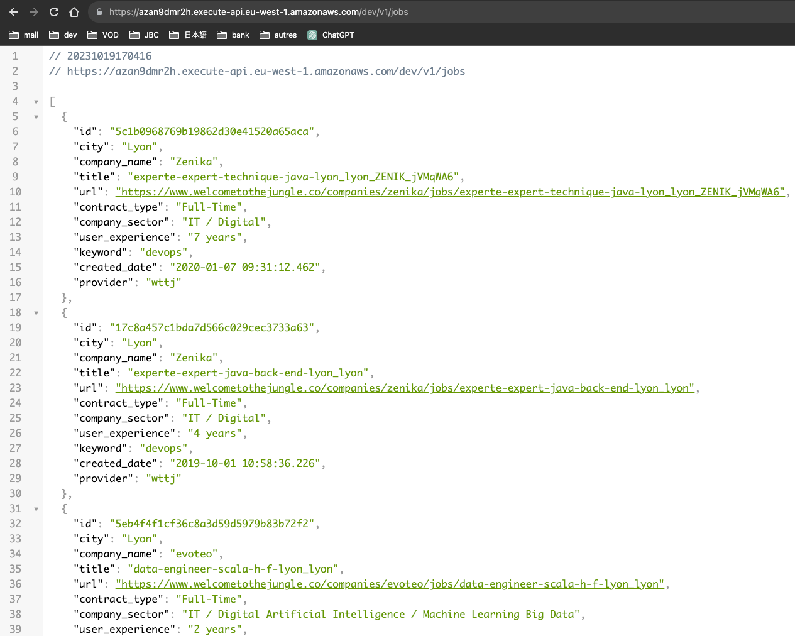
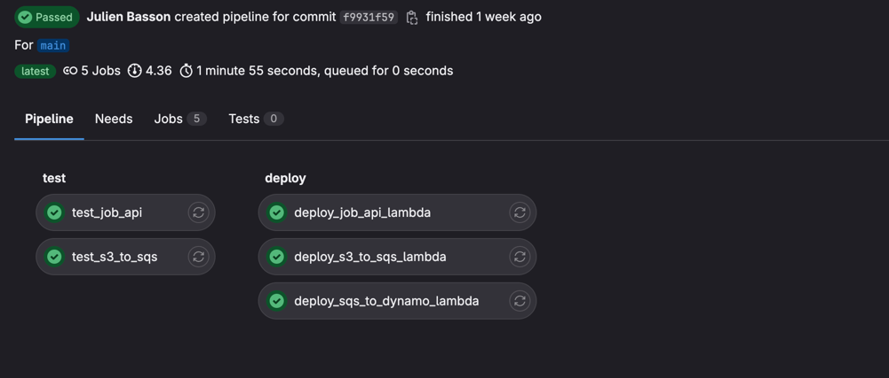

# Practical: Serverless Backend

## Pre requisites

* Install [**Terraform**](https://www.terraform.io/downloads)
* Install [**Node**](https://nodejs.org/en/download)
* Install [**AWS CLI**](https://docs.aws.amazon.com/cli/latest/userguide/getting-started-install.html)

Have an AWS User with the following policies:

* IAMFullAccess
* AmazonS3FullAccess
* AmazonDynamoDBFullAccess
* CloudWatchLogsFullAccess
* AWSLambda_FullAccess

We also have to initialize terraform with the command (execute it in the *terraform* directory) :

```shell
terraform init
```

## Context


The purpose of this practical is to create a complete serverless backend with on one side a s3/lambda/SQS/DynamoDB based 
data treatment pipeline to convert raw csv file into exploitable data in a DynamoDB.

On the other hand the backend is composed of an API Gateway and a lambda that expose APIs to either GET, POST or DELETE jobs from
the DynamoDB.

When the backend will be up and running we will set up the CI/CD with GitlabCI to build, test and deploy the lambda automatically.


## Tasks

During the practical, I recommend applying your terraform changes after every task to debug your errors, step by step

### Part 1: S3 and lambda SQS producer

During this part you will set up the s3 bucket in which the job data CSV are going to be uploaded,
then, you will create the SQS queue that will receive the messages sent by the lambda and finally
you will create the lambda function that will treat this CSV file and create messages in the SQS queue.


#### s3:

The first step will be to create an *[**aws_s3_bucket**](https://registry.terraform.io/providers/hashicorp/aws/latest/docs/resources/s3_bucket)*
and inside it an empty directory **job_offers/** with the *[**aws_s3_object**](https://registry.terraform.io/providers/hashicorp/aws/latest/docs/resources/aws_s3_object)* resource

#### SQS:
Now we need to create the *[**aws_sqs_queue**](https://registry.terraform.io/providers/hashicorp/aws/latest/docs/resources/sqs_queue)* 
that will contain the job offer messages and another one that will be the dead letter queue (that will receive the messages that could not be processed correctly).

The first queue will have a **redrive_policy** that will target the dead letter queue (second queue) with a **maxReceiveCount** of 4.

#### IAM:

Now we will have to create an *[**aws_iam_role**](https://registry.terraform.io/providers/hashicorp/aws/latest/docs/resources/iam_role)* named **s3_to_sqs_lambda_role** for the service **lambda.amazonaws.com** 
then we will add an *[**aws_iam_role_policy**](https://registry.terraform.io/providers/hashicorp/aws/latest/docs/resources/iam_role_policy)* linked to the previously created **iam_role** with the following policy:
```json
{
    "Version": "2012-10-17",
    "Statement": [
        {
            "Effect": "Allow",
            "Action": "s3:*",
            "Resource": "${aws_s3_bucket.s3_job_offer_bucket.arn}/*"
        }
    ]
}
```
(replace the aws_s3_bucket by yours if you didn't name it (the terraform resource) s3_job_offer_bucket)


This policy will allow our *s3_to_sqs_lambda* to retrieve files from the previously created, s3 bucket.


After that we also need to add a second *[**aws_iam_role_policy**](https://registry.terraform.io/providers/hashicorp/aws/latest/docs/resources/iam_role_policy)* with the following policy:

```json
{
    "Version": "2012-10-17",
    "Statement": [
        {
            "Effect": "Allow",
            "Action": "sqs:SendMessage",
            "Resource": "${aws_sqs_queue.job_offers_queue.arn}"
        }
    ]
}
```
(same here, change the name of the aws_sqs_queue if you did not call the resource **"job_offers_queue"**)

This policy will allow our *s3_to_sqs_lambda* to send messages to the previously created queue.


#### lambda:

Then, we will need to create an *aws_lambda_function* that will be triggered when a file is uploaded to the **job_offers** directory of the previously created bucket.

The *aws_lambda_function* named **s3_to_sqs_lambda** will have **index.handler** has handler, a memory_size of **512**, a timeout of **900** the runtime will be : **nodejs18.x**,
the filename will be **data.archive_file.empty_zip_code_lambda.output_path** (defined in the template).
You will also need to link the lambda to the iam_role created earlier and to add an environment variable like :
```terraform
  environment {
    variables = {
      QUEUE_URL = aws_sqs_queue.job_offers_queue.url
    }
  }
```
(change the name of the aws_sqs_queue if you did not call the resource **"job_offers_queue"**)

After the lambda creation we also need an *[**aws_lambda_permission**](https://registry.terraform.io/providers/hashicorp/aws/latest/docs/resources/lambda_permission)* 
with a statement_id **AllowExecutionFromS3Bucket*, an action **lambda:InvokeFunction**, the function_name will be the name of your lambda function (defined above),
the principal of your lambda_permission will be **s3.amazonaws.com** and the source_arn is the arn of your s3_bucket defined earlier.


#### s3:

Finally, we will need an *[**aws_s3_bucket_notification**](https://registry.terraform.io/providers/hashicorp/aws/latest/docs/resources/s3_bucket_notification#add-notification-configuration-to-lambda-function)*
linked to our previously created bucket and lambda function that will be triggered on events like **"s3:ObjectCreated:*"** with the key of the previously created aws_s3_object as a filter_prefix and **".csv"** as a filter_suffix


#### Testing

Now to test our s3_to_sqs lambda we need to:
1. apply the terraform changes with `terraform apply`
2. run the lambda deployment script: `./bin/deploy_s3_to_sqs_lambda.sh`
3. Finally, we can either upload a file in the bucket using the AWS console, or run `./bin/send_s3_event.sh`
4. To see if everything works fine you can go to the SQS service on the AWS console, find your job_offers_queue and check if there is messages in it

To debug if anything when wrong you can check the CloudWatch logs of your lambda function, to do so, go to your lambda function and in the Monitor tab you will find a button to
see the cloudwatch logs.



### Part 2: DynamoDB and lambda SQS consumer

Now that we have a lambda that send messages to a SQS queue we would like another one that reads this queue and insert the job offers into a DynamoDB.

#### DynamoDB:

First we will create our *[**aws_dynamodb_table**](https://registry.terraform.io/providers/hashicorp/aws/latest/docs/resources/dynamodb_table)*,
you can find the name in the variables.tf, the billing_mode will be **PROVISIONED** with a read_capacity and a write_capacity of 5,
the hash_key will be **id** and the range_key **city**, both of them will need to be defined as attributes of type **S**

#### IAM:

Now we will have to create an *[**aws_iam_role**](https://registry.terraform.io/providers/hashicorp/aws/latest/docs/resources/iam_role)* named **sqs_to_dynamo_lambda_role** for the service **lambda.amazonaws.com**
then we will add an *[**aws_iam_role_policy**](https://registry.terraform.io/providers/hashicorp/aws/latest/docs/resources/iam_role_policy)* linked to the previously created **iam_role** with a policy that allow the actions:
*   "sqs:ReceiveMessage"
*   "sqs:DeleteMessage"
*   "sqs:GetQueueAttributes"

on your job_offers SQS queue.

We'll also need another *[**aws_iam_role_policy**](https://registry.terraform.io/providers/hashicorp/aws/latest/docs/resources/iam_role_policy)* to allow the action **dynamodb:PutItem** on the previously created DynamoDB.

This policy will allow our *s3_to_sqs_lambda* to retrieve files from the previously created, s3 bucket.


#### lambda:

Then, we will need to create an *aws_lambda_function* that will be triggered when a message is sent to the previously created SQS queue.

The *aws_lambda_function* named **sqs_to_dynamo_lambda** will have **index.handler** has handler, a memory_size of **512**, a timeout of **900** the runtime will be : **nodejs18.x**,
the filename will be **data.archive_file.empty_zip_code_lambda.output_path** (defined in the template).
You will also need to link the lambda to the iam_role created earlier and to add an environment variable like :
```terraform
  environment {
    variables = {
      TABLE_NAME = aws_dynamodb_table.job-table.name
    }
  }
```
(change the name of the aws_dynamodb_table if you did not call the resource **job-table**)

After the lambda creation we also need an *[**aws_lambda_permission**](https://registry.terraform.io/providers/hashicorp/aws/latest/docs/resources/lambda_permission)*
with a statement_id **AllowExecutionFromSQS**, an action **lambda:InvokeFunction**, the function_name will be the name of your lambda function (defined above),
the principal of your lambda_permission will be **sqs.amazonaws.com** and the source_arn is the arn of your aws_sqs_queue defined earlier.


#### SQS:

Finally, we will need an *[**aws_lambda_event_source_mapping**](https://registry.terraform.io/providers/hashicorp/aws/latest/docs/resources/lambda_event_source_mapping)*
with the job_offers_queue ARN as **event_source_arn** and the sqs_to_dynamo_lambda's name as **function_name**


#### Testing

Now to test our sqs_to_dynamo lambda we need to:
1. apply the terraform changes with `terraform apply`
2. deploy the 2 lambdas by running the script: `./bin/deploy_sqs_to_dynamo_lambda.sh`
3. Finally, we can either upload a file in the bucket using the AWS console, or run `./bin/send_s3_event.sh`
4. To see if everything works fine you can go to the DynamoDB service on the AWS console, find your table and check if there are elements in it


### Part 3: API Gateway and Job API Lambda

We now have a DynamoDB with a data ingestion pipeline to fill it with data, what we need to do now is to create an API to expose this data.


#### IAM:

Now we will have to create an *[**aws_iam_role**](https://registry.terraform.io/providers/hashicorp/aws/latest/docs/resources/iam_role)* named **job_api_lambda_role** for the service **lambda.amazonaws.com**
then we will add an *[**aws_iam_role_policy**](https://registry.terraform.io/providers/hashicorp/aws/latest/docs/resources/iam_role_policy)* linked to the previously created **iam_role** with the following policy:
```json
{
    "Version": "2012-10-17",
    "Statement": [
        {
            "Effect": "Allow",
            "Action": "dynamodb:*",
            "Resource": "${aws_dynamodb_table.job-table.arn}"
        }
    ]
}
```
(replace the dynamo table by yours if you didn't name it (the terraform resource) job-table)

We will also need an *[**aws_iam_role_policy_attachment**](https://registry.terraform.io/providers/hashicorp/aws/latest/docs/resources/iam_role_policy_attachment)* to attach the policy named **lambda_exec_policy_arn** in the variables.tf to the previously created iam_role.

#### Lambda:

Then, we will need to create an *aws_lambda_function* that will act as the facade of our job API.

The *aws_lambda_function* named **job_api_lambda** will have **index.handler** has handler, a memory_size of **512**, a timeout of **30** the runtime will be : **nodejs18.x**,
the filename will be **data.archive_file.empty_zip_code_lambda.output_path** (defined in the template).
You will also need to link the lambda to the iam_role created earlier and to add an environment variable like :
```terraform
  environment {
    variables = {
      TABLE_NAME = aws_dynamodb_table.job-table.name
    }
  }
```
(change the name of the aws_dynamodb_table if you did not call the resource **job-table**)


#### API Gateway:

We now have our API deployed on a lambda but it is not accessible via an HTTP call, so we will need to create an API Gateway to make that possible.

To create the AGW we will need a few resources, the first one being: *[**aws_apigatewayv2_api**](https://registry.terraform.io/providers/hashicorp/aws/latest/docs/resources/apigatewayv2_api)* with the name **job_api_gw** and the protocol **HTTP**.
Then a *[**aws_apigatewayv2_stage**](https://registry.terraform.io/providers/hashicorp/aws/latest/docs/resources/apigatewayv2_stage)* linked to the previously created *aws_apigatewayv2_api*, named **dev** with the **auto_deploy** enabled and the following **access_log_settings**:
```terraform
    access_log_settings {
        destination_arn = aws_cloudwatch_log_group.api_gw.arn

        format = jsonencode({
            requestId               = "$context.requestId"
            sourceIp                = "$context.identity.sourceIp"
            requestTime             = "$context.requestTime"
            protocol                = "$context.protocol"
            httpMethod              = "$context.httpMethod"
            resourcePath            = "$context.resourcePath"
            routeKey                = "$context.routeKey"
            status                  = "$context.status"
            responseLength          = "$context.responseLength"
            integrationErrorMessage = "$context.integrationErrorMessage"
        }
        )
    }
```

I give in the project template an **aws_cloudwatch_log_group.api_gw** resource (commented) make sure to uncomment it and rename if needed the gateway inside.

You will also need to add an output variable in the output.tf file that will log the **aws_apigatewayv2_stage.job_api_gw_dev_stage.invoke_url**


After that we will create an *[**aws_apigatewayv2_integration**](https://registry.terraform.io/providers/hashicorp/aws/latest/docs/resources/apigatewayv2_integration)* linked to our previously created *aws_apigatewayv2_api*, the *integraiton_uri* wil be the **invoke_arn** of the job-api lambda,
the *integration_type* is **AWS_PROXY** and the *integration_method* is **POST**. We will also need to add the following *request_parameters* to our integration:

```terraform
    request_parameters = {
        "overwrite:path" = "$request.path"
    }
```

This parameter will remove the "/dev" of the request when it enters into the Express Server of the Jop Api so we don't need to add the "dev" in every route we define in the API.

Finally, we will add an *[**aws_apigatewayv2_route**](https://registry.terraform.io/providers/hashicorp/aws/latest/docs/resources/apigatewayv2_route)* linked to our previously created *aws_apigatewayv2_api*, with a *route_key* **ANY /{proxy+}** and a *target* like:

```terraform
target = "integrations/${aws_apigatewayv2_integration.job_api_gw_integration.id}"
```

The "ANY /{proxy+}" will redirect every HTTP verb (GET, POST, DELETE, PUT, PATCH etc...) to our lambda,
so if we call GET https://INVOKE_URL/dev/v1/jobs (where INVOKE_URL is the url of the AGW that will be known after the terraform apply), the GET request
will reach the Express Server of the Job API with the path : */v1/jobs*.


#### Testing

Now to test our job_api lambda we need to:
1. apply the terraform changes with `terraform apply`, retrieve the invoke_url from the output
2. deploy the 2 lambdas by running the script: `./bin/deploy_job_api_lambda.sh`
3. To see if everything works fine you can go to your browser and go to **<YOUR_INVOKE_URL>/v1/jobs**, and you should see a json containing the data present in your dynamoDB




### Part 4: CI / CD with GitlabCI


Now that we have our infrastructure up and running we would like to automatically test and deploy all those lambdas and that is why we are going to setup the
Continuous Integration / Continuous Deployment pipeline.

The pipeline will be composed of 2 stages: **test** and **deploy**.

#### Deployer User

The first thing we'll need is an AWS user that has the **AWSLambda_FullAccess** policy attached to,
now we need to create access key to be able to identify as this user.

When that is done we can create two CI/CD variables:

```shell
AWS_ACCESS_KEY_ID

AWS_SECRET_ACCESS_KEY
```

with their corresponding values.


#### Test Stage

Now we can create a **.gitlab-ci.yml** file and use **sleavely/node-awscli:18.x** as the docker **image**.

Then we'll create 2 jobs, one to test the job_api_lambda and another one to test s3_to_sqs_lambda.

Those jobs will first run **npm --prefix src/<LAMBDA_NAME> install** and then **npm --prefix src/<LAMBDA_NAME> run test**.

(of course you'll replace the <LAMBDA_NAME> by the name of each package: job_api_lambda, s3_to_sqs_lambda and sqs_to_dynamo_lambda)

#### Deploy Stage

Now we'll create 3 jobs to deploy each of our 3 lambdas, each job will first run **npm --prefix src/<LAMBDA_NAME> install** and then run respectively **./bin/deploy_job_api_lambda.sh**, **./bin/deploy_s3_to_sqs_lambda.sh**, **./bin/deploy_sqs_to_dynamo_lambda.sh**.

your pipeline should look like this


# Destroy 

Now that you have finished the exercise you can delete the infra using
```shell
terraform destroy
```
